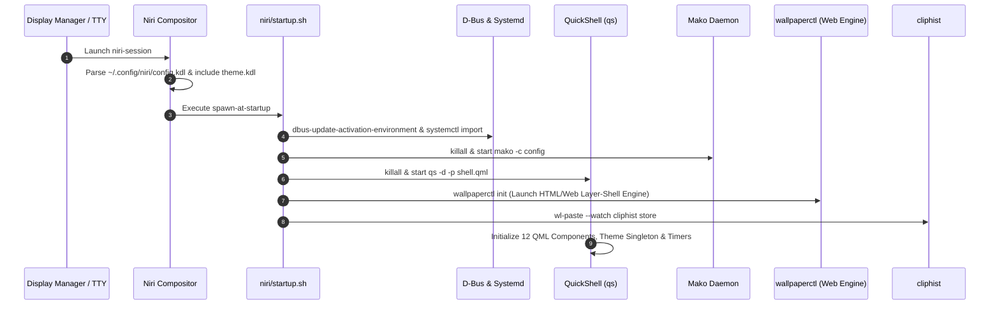

# 🏗️ Architecture & Communication Flow

This document details the architectural topology, communication protocols, IPC layers, and process lifecycles that power **Dark Niri**.

---

## 1. Architectural Layers

Dark Niri separates responsibilities into four distinct layers:

1. **Compositor & Display Server Layer (Niri):**
   - Manages Wayland surfaces, output displays, input devices, keyboard focus, and window column tiling.
   - Enforces window rules (including global auto-maximization `default-column-width { proportion 1.0; }`).
   - Handles low-level keybinding dispatch and application spawning.
2. **Desktop Shell & Presentation Layer (QuickShell & Rofi):**
   - Renders the dynamic status bar with 4 in-GUI selectable styles (`Floating`, `Islands`, `Normal`, `Compact`).
   - Renders interactive popups, settings modals, 1-Click Theme Studio, notification lists, and media player controls in QML.
   - Binds UI states reactively to the `Components.Theme` singleton.
3. **Subsystem & Native Tooling Layer (Compiled Rust & Shell):**
   - Translates high-level UI commands into system-level tool invocations via zero-overhead native Rust binaries (`dark-tools-rs`: `wifi`, `bluetooth`, `notifications`, `net-tracker`, `daily-network-logger`, `theme-manager`, `wallpaper-engine`).
   - Gathers hardware metrics from `/proc`, `/sys`, `hwmon`, and `nvidia-smi`, outputting structured JSON for QML ingestion.
4. **Linux Kernel & Service Layer:**
   - D-Bus system/session buses, systemd user services, PipeWire/WirePlumber, NetworkManager, BlueZ, and kernel sysfs nodes.

---

## 2. Process Lifecycle & Execution Flow

---

## 3. Communication Channels & Protocols

| Subsystem | Channel / Protocol | Tools / Binaries | Handled By |
| :--- | :--- | :--- | :--- |
| **Compositor IPC** | UNIX Domain Socket (`niri msg -j ...`) | `niri` CLI | `Workspaces.qml`, `Settings.qml` |
| **Theme & Style Engine** | Direct Process & Config Generation | `theme-manager` (Rust) | `Theme.qml`, `theme.kdl`, `theme.rasi`, `fuzzel.ini`, `mako` |
| **Network Management** | D-Bus (`org.freedesktop.NetworkManager`) + `nmcli` | `wifi` (`dark-tools-rs`) | `wifi.sh`, `Network.qml`, `Settings.qml` |
| **Bluetooth Subsystem** | D-Bus (`org.bluez`) + PulseAudio Card Profiles | `bluetooth` (`dark-tools-rs`), `pactl` | `bluetooth.sh`, `Bluetooth.qml`, `Settings.qml` |
| **Audio Routing** | PipeWire Native Protocol & Pulse Compatibility | `wpctl`, `pactl` | `Audio.qml`, `Mic.qml`, `niri/osd.sh`, `Settings.qml` |
| **Hardware Metrics** | `/proc/stat`, `/proc/meminfo`, `/proc/uptime`, `sensors`, `/sys` | `sysinfo.sh` (JSON) | `SysInfo.qml` |
| **Power Management** | D-Bus (`net.hadess.PowerProfiles`, `org.freedesktop.UPower`) | `powerprofilesctl`, `upower`, sysfs | `powerprofile.sh`, `Battery.qml`, `Settings.qml` |
| **Media (MPRIS)** | D-Bus (`org.mpris.MediaPlayer2.*`) | `playerctl` | `media.sh`, `Media.qml` |
| **Notifications** | D-Bus (`org.freedesktop.Notifications`) | `notifications` (`dark-tools-rs`), `mako` | `notifications.sh`, `Settings.qml` |
| **Screen Capture** | Wayland Protocol (`zwlr_screencopy_v1`) | `wf-recorder`, `slurp`, `grim` | `screencast.sh`, `Screencast.qml`, `config.kdl` |
