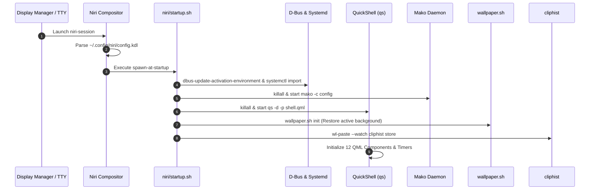

# 🏗️ Architecture & Communication Flow

This document details the architectural topology, communication protocols, IPC layers, and process lifecycles that power **Dark Niri**.

---

## 1. Architectural Layers

Dark Niri separates responsibilities into four distinct layers:

1. **Compositor & Display Server Layer (Niri):**
   - Manages Wayland surfaces, output displays, input devices, keyboard focus, and window column tiling.
   - Handles low-level keybinding dispatch and global application spawning.
2. **Desktop Shell & Presentation Layer (QuickShell & Rofi):**
   - Renders the permanent top bar (`PanelWindow` at 55px height).
   - Renders interactive popups, settings modals, notification lists, and media player controls in QML.
   - Dispatches user input to underlying helper scripts.
3. **Subsystem & Helper Script Layer (Shell & Python):**
   - Translates high-level UI commands into system-level tool invocations (`nmcli`, `bluetoothctl`, `wpctl`, `brightnessctl`, `powerprofilesctl`).
   - Gathers hardware metrics from `/proc`, `/sys`, `hwmon`, and `nvidia-smi`, formatting them into structured JSON or pipe-delimited strings for QML ingestion.
4. **Linux Kernel & Service Layer:**
   - D-Bus system/session buses, systemd user services, PipeWire/WirePlumber, NetworkManager, BlueZ, and kernel sysfs nodes.

---

## 2. Process Lifecycle & Execution Flow

---

## 3. Communication Channels & Protocols

| Subsystem | Channel / Protocol | Tools / Binaries | Handled By |
| :--- | :--- | :--- | :--- |
| **Compositor IPC** | UNIX Domain Socket (`niri msg -j ...`) | `niri` CLI | `Workspaces.qml`, `Settings.qml` |
| **Network Management** | D-Bus (`org.freedesktop.NetworkManager`) + `nmcli` | `gdbus`, `nmcli`, Python `subprocess` | `wifi.sh`, `Network.qml`, `Settings.qml` |
| **Bluetooth Subsystem** | D-Bus (`org.bluez`) + PulseAudio Card Profiles | `bluetoothctl`, `pactl`, Python `subprocess` | `bluetooth.sh`, `Bluetooth.qml`, `Settings.qml` |
| **Audio Routing** | PipeWire Native Protocol & Pulse Compatibility | `wpctl`, `pactl` | `Audio.qml`, `Mic.qml`, `niri/osd.sh`, `Settings.qml` |
| **Hardware Metrics** | `/proc/stat`, `/proc/net/dev`, `/sys/class/hwmon` | Bash, `awk`, `free`, `nvidia-smi` | `sysinfo.sh`, `SysInfo.qml` |
| **Power Management** | D-Bus (`net.hadess.PowerProfiles`, `org.freedesktop.UPower`) | `powerprofilesctl`, `upower`, sysfs | `powerprofile.sh`, `Battery.qml`, `Settings.qml` |
| **Media (MPRIS)** | D-Bus (`org.mpris.MediaPlayer2.*`) | `playerctl` | `media.sh`, `Media.qml` |
| **Notifications** | D-Bus (`org.freedesktop.Notifications`) | `makoctl`, `notify-send` | `notifications.sh`, `mako`, `Settings.qml` |
| **Screen Capture** | Wayland Protocol (`zwlr_screencopy_v1`) | `wf-recorder`, `slurp`, `grim` | `screencast.sh`, `Screencast.qml`, `config.kdl` |
