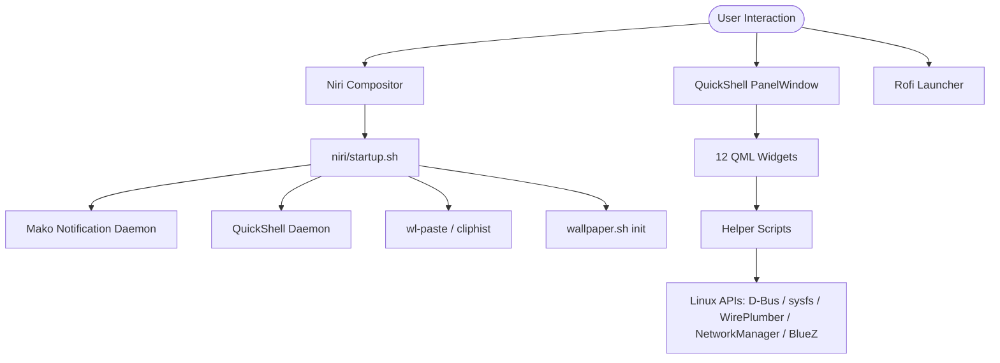

# 🌌 Dark Niri Documentation Suite

Welcome to the comprehensive, developer-quality documentation suite for **Dark Niri Dotfiles**.

Dark Niri is an aesthetic, high-performance, Wayland-native desktop environment engineered around the **Niri** scrollable-tiling compositor, coupled with a custom **QuickShell** (QtQuick/QML) status bar and control center, a customized **Rofi** launcher, a **Mako** notification daemon, and modular background scripts.

---

## 📚 Complete Documentation Index

| Document | Topic & Scope |
| :--- | :--- |
| [`ARCHITECTURE.md`](ARCHITECTURE.md) | High-level system architecture, IPC channels, D-Bus protocols, and process lifecycle |
| [`FILE_STRUCTURE.md`](FILE_STRUCTURE.md) | Exhaustive directory and file breakdown with dependencies, purpose, and safety rules |
| [`FEATURES.md`](FEATURES.md) | Complete feature audit with implementation status matrix |
| [`PACKAGES.md`](PACKAGES.md) | Full package catalog classified by role (Core, QuickShell, Audio, GPU, AUR, etc.) |
| [`DEPENDENCIES.md`](DEPENDENCIES.md) | Traceability matrix: Component → Script → Command → Package → Failure Mode |
| [`KEYBINDS.md`](KEYBINDS.md) | Master keybinding and shortcut reference table |
| [`NIRI.md`](NIRI.md) | Deep dive into Niri compositor configuration, layout geometry, rules, and binds |
| [`QUICKSHELL.md`](QUICKSHELL.md) | QuickShell panel architecture, lifecycle, and documentation for all 12 QML components |
| [`SYSTEM_MONITOR.md`](SYSTEM_MONITOR.md) | Hardware monitoring subsystem (CPU, RAM, AMD iGPU, NVIDIA dGPU, Network traffic) |
| [`MEDIA.md`](MEDIA.md) | MPRIS media player widget, album art resolution, and playback controls |
| [`SETTINGS.md`](SETTINGS.md) | Comprehensive Control Center breakdown (Flyout, Modals, Sliders, Actions) |
| [`NETWORK.md`](NETWORK.md) | Wi-Fi management, D-Bus WPS detection, credentials, and connection lifecycle |
| [`BLUETOOTH.md`](BLUETOOTH.md) | Bluetooth device discovery, pairing, battery status, and PulseAudio profiles |
| [`AUDIO.md`](AUDIO.md) | PipeWire/WirePlumber integration, sink/source volume, muting, and OSD hints |
| [`POWER.md`](POWER.md) | Power profile cycling, UPower battery monitoring, and power actions |
| [`DISPLAY.md`](DISPLAY.md) | Backlight control, live video/static wallpapers, and canvas color rendering |
| [`NOTIFICATIONS.md`](NOTIFICATIONS.md) | Mako daemon configuration and QuickShell interactive notification center |
| [`SCRIPTS.md`](SCRIPTS.md) | Exhaustive audit of all 14 shell and Python helper scripts |
| [`SERVICES.md`](SERVICES.md) | Background daemons, D-Bus activation, and systemd integration |
| [`THEMES.md`](THEMES.md) | Tokyo Night design system, color palette, typography, and geometry tokens |
| [`INSTALLATION.md`](INSTALLATION.md) | Step-by-step installation guide for Arch Linux and Wayland systems |
| [`CONFIGURATION.md`](CONFIGURATION.md) | User manual for modifying layouts, keybinds, polling rates, and styling |
| [`CUSTOMIZATION.md`](CUSTOMIZATION.md) | Advanced guide for adding custom QML widgets, scripts, and backends |
| [`TROUBLESHOOTING.md`](TROUBLESHOOTING.md) | Diagnostic matrices, log commands, failure modes, and fixes |
| [`SECURITY.md`](SECURITY.md) | Security audit of sudo prompts, shell executions, and path sandboxing |
| [`PORTABILITY.md`](PORTABILITY.md) | Portability audit, interface name assumptions, and multi-user readiness |
| [`DEVELOPMENT.md`](DEVELOPMENT.md) | Development workflow, isolated widget testing, and contribution standards |

---

## ⚡ Quick System Topology

